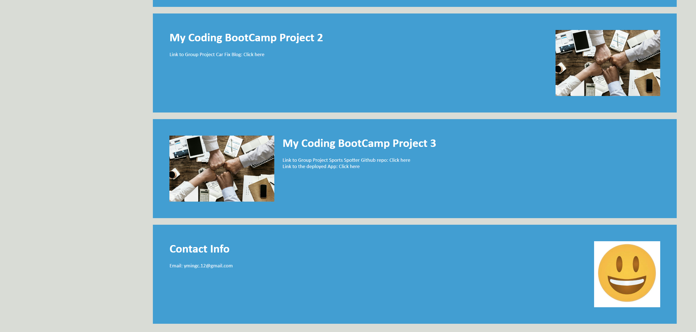

# My Portfolio

This is my portfolio website.

## Description

Wellcome to my portfolio. This is an introduction of me, Yanming Cai. VS Code is used to develop this website. It contains HTML, CSS, images, and Readme files.

Screenshots of webpage:

#

Link to the repository: https://github.com/YC937/YMPortfolio2

Link to the deployed website: https://yc937.github.io/YMPortfolio2/

Please feel free to contact me. I like making friends!

&copy;Copyright YM C
